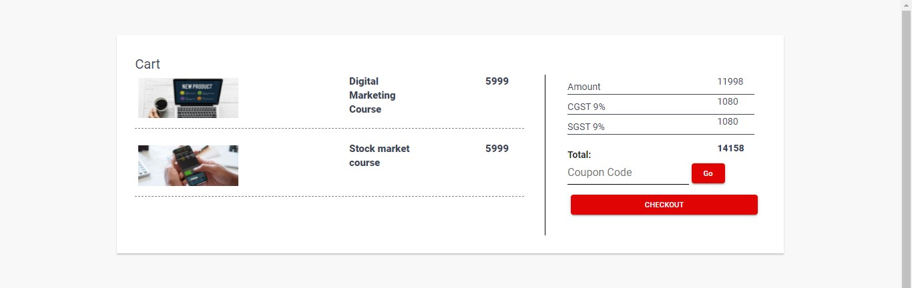
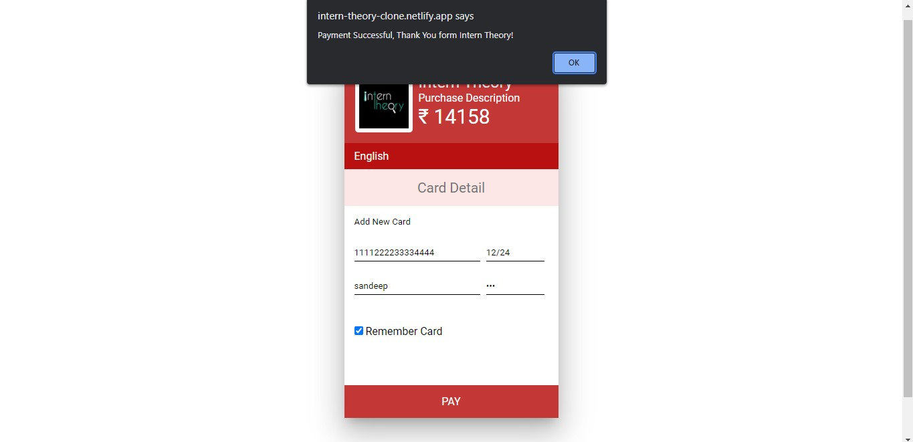

# Unit2_InternTheory.com Clone
This project is made for educational purpose

## About Us
In the course of the second unit here at Masai School, we learned HTML and CSS along with JS DOM, Constructor functions, Prototype and Inheritance, the usage of local storage and client Server Model, Asynchronous Programming, and Promises.

At the end of our second unit, we were given a project as a part of our curriculum. We are assigned a website to clone as a construct week project. In this project we have to use all the skills we have learned till now. I had to clone [intern theory](https://www.interntheory.com/).

## About intern theory
This website is basically a internship website where you can find different types of internship regarding to your choice. This internship help you to upgrade your tech skills. so that you can perform good in the industry.

## Tech Stacks Used
- HTML
- CSS
- JavaScript

## Functionality of the Project
1. Landing Page 
2. Sign in/Sign up page.
3. Internship page Displayed in grid.
4. Course page displayed in grid.
5. Cart Page
6. Payment Gateway.

## Glimes Of my project
1. Landing Page

2. Internship Page

3. Internship Description Page

4. Course Page

5. Cart page

6. Payment Page

